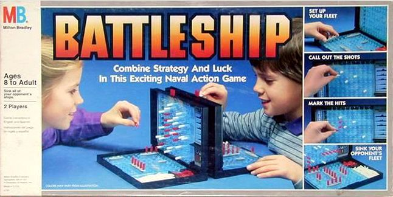
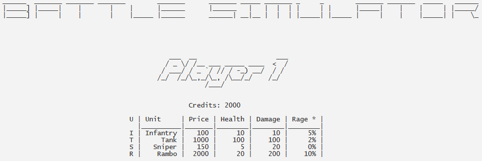
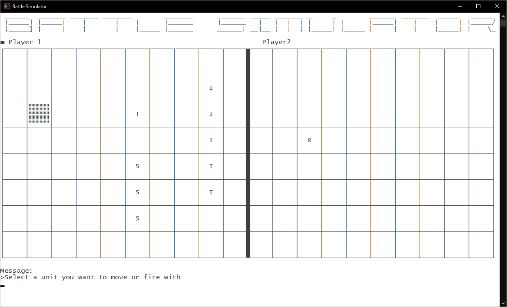

# Battle Simulator

Battle Simulator is a turn based tank game based on the popular game battleships developed by [Michel Dequick](https://github.com/MichelDequick), a third year student at VIVES.

The project was an assignment for the course Object Oriented Programming with C++. Students had to build a tank game with the mechanics of the old-school game BattleShips. They had to visualize the battlefield in the console. No other strict requirements were made, so they could show off their creativity.

At the beginning of the game, both players choose their weapons of choice and place them on the battlefield.

Once all money is spend, it's a fight to the death between both players. May the best tanker win.

The source code is available at our [GitHub repository](https://github.com/VIVES-Elektronica-ICT-Brugge/BattleSimulator).